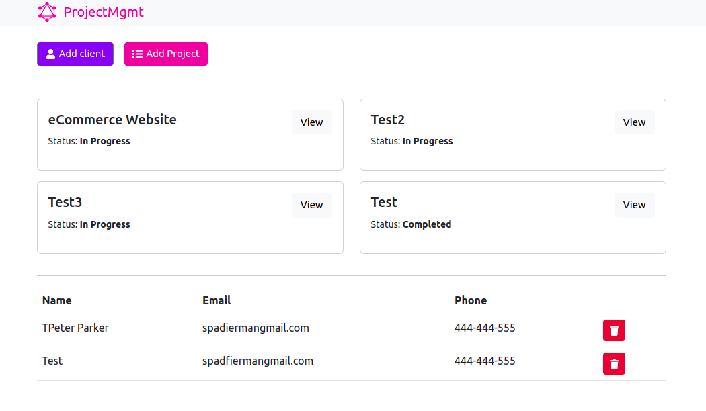

# Project-mgmt-app

### [Site link](https://project-mgmt-app2022.herokuapp.com/)

<kbd>
  
</kbd>

### 🛠 The tech stack is:

- [React](https://reactjs.org/)
- [TypeScript](https://www.typescriptlang.org/)
- [Express](https://expressjs.com/)
- [Mongoose](https://www.npmjs.com/package/mongoose)
- [GraphQL](https://www.npmjs.com/package/graphql)
- [Apollo-Client](https://www.npmjs.com/package/@apollo/client)
- [React-router-dom](https://reactrouter.com/docs/en/v6/getting-started/overview)
- [eslint](https://eslint.org/)
- [stylelint](https://stylelint.io/)
- [prettier](https://prettier.io/)
